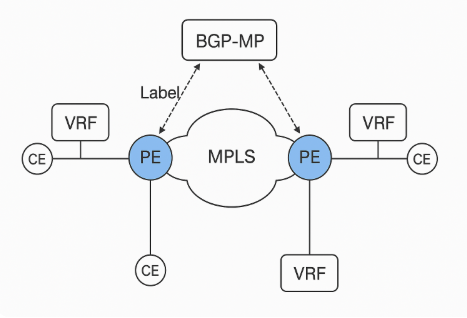

# MPLS and VPN

## 1. MPLS: CE, PE, P Overview

| Device             | Description                                                                                                               |
| ------------------ | ------------------------------------------------------------------------------------------------------------------------- |
| CE (Customer Edge) | Router at the customer site. Connects to the provider network (PE). No MPLS functionality required.                       |
| PE (Provider Edge) | Router at the edge of the provider network. Supports MPLS and VRFs. Exchanges routes with CE using BGP/OSPF/EIGRP/static. |
| P (Provider)       | Core MPLS router. Handles label switching only (no customer awareness).                                                   |

```
[CE]---[PE]---[P]---[P]---[PE]---[CE]
```

## 2. MP-BGP (Multiprotocol BGP)

### MP-BGP is used between PE routers to carry VPNv4 routes, which include:

- Route Distinguisher (RD): Makes IP prefixes unique.

- VPN label: Used to forward traffic to correct CE.

- Next-Hop: PE loopback address.

 MP-BGP exchanges routes between VRFs across the MPLS cloud.

### MP-BGP Address Family

- Address Family: VPNv4 (AFI: 1, SAFI: 128)

- Requires:

        - neighbor x.x.x.x activate

        - neighbor x.x.x.x send-community extended

        - address-family vpnv4

### MP-BGP Path Components

| Attribute | Purpose                              |
| --------- | ------------------------------------ |
| RD        | Uniquely identifies customer route   |
| RT        | Used for route import/export in VRFs |
| Next-Hop  | Indicates which PE to reach          |
| Label     | MPLS label to reach destination CE   |
```
BGP Update:
RD: 100:1
Prefix: 10.1.1.0/24
Next-Hop: 192.0.2.1
VPN Label: 100
```
## 3. VRF (Virtual Routing and Forwarding)

VRF is a logical routing table instance on a PE device that allows overlapping IP addresses.

| Component | Description                                   |
| --------- | --------------------------------------------- |
| RD        | Uniquely identifies VPN route                 |
| RT        | Controls import/export of routes between VRFs |
| Interface | Assigned to a VRF, isolates routing           |

```
ip vrf CUSTOMER1
 rd 100:1
 route-target export 100:1
 route-target import 100:1

interface Gig0/0
 ip vrf forwarding CUSTOMER1
 ip address 10.1.1.1 255.255.255.0
```
## 4. FIB/FLS (Forwarding Information Base / Label Switching)

| Table                             | Purpose                               |
| --------------------------------- | ------------------------------------- |
| RIB (Routing Information Base)    | Control plane routing table           |
| FIB (Forwarding Information Base) | Optimized data plane forwarding table |
| LFIB (Label FIB)                  | Used for label-based forwarding       |

<b>In MPLS:</b>

+ PE receives IP packet, checks VRF, adds MPLS label (via MP-BGP).

+ P routers do label switching based on LFIB.

+ Final PE removes label and forwards to CE.

## 5. Site-to-Site IPsec VPN

Encrypts traffic between two sites over the public Internet.

<b>Components:</b>

| Phase        | Function                            |
| ------------ | ----------------------------------- |
| IKE Phase 1  | Establish secure tunnel (ISAKMP SA) |
| IKE Phase 2  | Negotiate IPsec SAs                 |
| IPsec Tunnel | Data encryption using ESP/AH        |

<b>Configuration Elements:</b>

    - ISAKMP Policy

    - Pre-shared key

    - Transform-set

    - Crypto ACL (interesting traffic)

    - Crypto Map

    - Tunnel endpoint (peer)

Example:
```
crypto isakmp policy 10
 encr aes
 hash sha
 authentication pre-share
 group 2

crypto isakmp key MYKEY address 203.0.113.1

crypto ipsec transform-set MYSET esp-aes esp-sha-hmac

crypto map VPNMAP 10 ipsec-isakmp
 set peer 203.0.113.1
 set transform-set MYSET
 match address 100

interface Gig0/0
 crypto map VPNMAP

```

## 6. Remote VPN Access (Client-to-Site IPsec)

Enables individual users (teleworkers) to connect securely to the corporate network.

| Feature        | Description                             |
| -------------- | --------------------------------------- |
| Authentication | Username/password or certificates       |
| Mode           | IPsec IKEv2, SSL VPN, AnyConnect        |
| Client         | Cisco AnyConnect or native IPsec client |

<b>Authentication:</b>

* Local user database or RADIUS/LDAP

* Supports split tunneling (only VPN-specific traffic goes through tunnel)

Example:
```
username remoteuser password 0 mypassword

crypto isakmp policy 10
 encr aes
 authentication pre-share

crypto isakmp client configuration group REMOTE
 key VPNKEY
 dns 8.8.8.8
 pool VPNPOOL

ip local pool VPNPOOL 10.10.10.10 10.10.10.50

```

 


